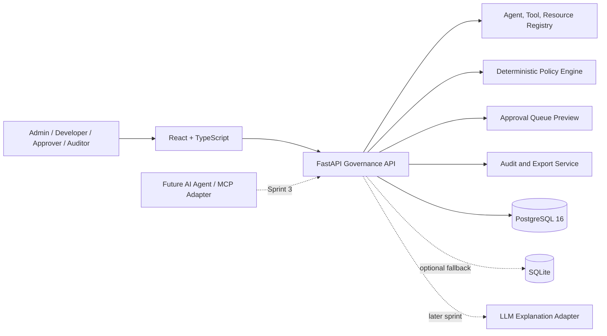
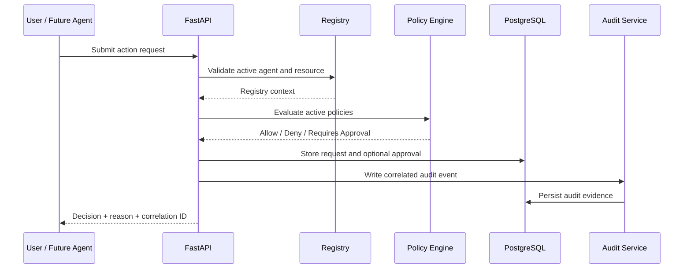

# AgentGuard Architecture — Sprint 2

## System Context

## Main Principle

Authorization is deterministic. An LLM may explain a completed decision in a later sprint, but it cannot decide whether an action is allowed.

## Request Flow

## Components

| Component | Sprint 2 responsibility |
|---|---|
| React Web App | Role demo, policy creation/status, simulator, approvals preview, audit filters and exports |
| FastAPI API | Validation, RBAC, orchestration, OpenAPI documentation |
| PostgreSQL | Primary system of record for registries, policies, versions, requests, approvals, and audits |
| Alembic | Repeatable versioned schema changes |
| Policy Engine | Priority, tie-breaking, context operators, and default deny |
| Audit Service | Correlated events, filtering, CSV/JSON export |
| CI | PostgreSQL migration and backend tests; Yarn frontend build |

## Policy Conflict Resolution

1. Evaluate active policies within the current organization.
2. Keep only matching policies.
3. Choose the highest numeric priority.
4. At equal priority, `deny` outranks `requires_approval`, which outranks `allow`.
5. Apply default deny when no policy matches.

## Multi-Agent Extensibility

AgentGuard does not claim universal native support for every agent framework. It defines a normalized request contract containing:

- Agent identity
- Requesting user
- Action
- Protected resource
- Environment
- Context attributes

Future agent or MCP adapters translate their native tool call into this contract. Sprint 3 can add one reference integration without changing the core policy model.

## Architecture Patterns

- Layered application architecture.
- Adapter boundary for policy engines and future agents.
- Default-deny security model.
- Append-oriented audit pattern.
- Human-in-the-loop workflow.
- Database migration pattern.
- Organization-scoped data access.

## Database Decision

SQLite reduced friction during Sprint 1. PostgreSQL is adopted from Sprint 2 because it better supports concurrent users, relational integrity, JSON policy context, audit filtering, CI parity, and managed cloud deployment. SQLite remains a documented fallback for isolated development only.
