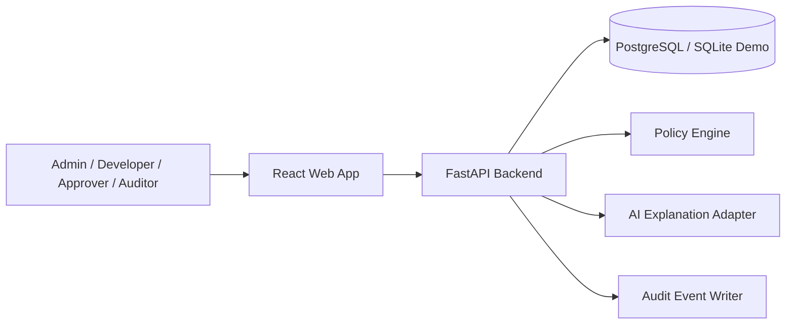

# Architecture

## System Context

## Main Design Decision

AgentGuard separates deterministic authorization from AI-generated explanations.

- The policy engine decides `allow`, `deny`, or `requires_approval`.
- The assistant only explains the completed decision.
- Every decision and approval action creates an audit event.

## Core Components

| Component | Responsibility |
|---|---|
| React Web App | Dashboard, simulator, policies, approvals, audit views |
| FastAPI Backend | API orchestration, validation, RBAC, business logic |
| SQL Database | Stores users, agents, tools, resources, policies, approvals, and audits |
| Policy Engine | Deterministic authorization decisions |
| Approval Workflow | Human-in-the-loop review for sensitive actions |
| Assistant Adapter | Plain-language explanations and incident summaries |
| CI/CD | Automated tests, builds, and deployment evidence |

## Architecture Patterns

- Layered architecture.
- Repository-ready API routing by domain.
- Policy adapter pattern.
- Default-deny access model.
- Audit-log pattern.
- Human-in-the-loop workflow.

## Deployment Options

| Option | Pros | Cons |
|---|---|---|
| Render/Railway | Fast setup, low cost, simple demos | Free tiers can sleep |
| Fly.io | Good Docker support | Slightly more setup |
| AWS ECS/Fargate | Enterprise-grade | Higher setup and cost |

Recommended capstone option: Render or Railway for speed and reviewer accessibility.
